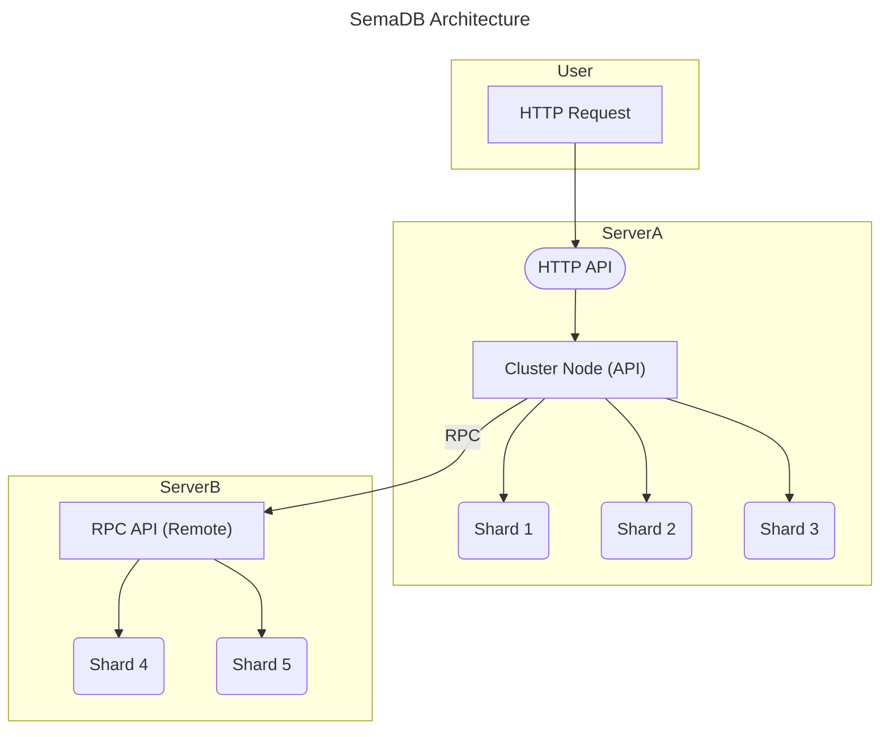

# Contributing

Thank you for considering to contribute! This repo is hopefully structured in an easy-to-understand manner and you can get started quickly.

Please:

1. Create an issue to track the contribution.
2. Follow the [fork and pull request](https://docs.github.com/en/get-started/quickstart/contributing-to-projects) approach.
3. Add documentation, ideally tests and `go test ./...`.
4. Please be nice to others 🚀 and follow the code of conduct.

> Thanks again!

## Architecture Design

SemaDB mainly resolves around these key components that correspond to the folders in the repository. In order from client request to lowest level handler:

- **HTTP API**: handles incoming client requests and is responsible for checking the payload, checking user information such as id and plan. It then forwards the request to the cluster node it is running on.
- **Cluster Node**: almost mirrors the http api to complete client requests. It manages remote procedure calls (RPC) to other servers and distributes data etc. It also stores the user collections information, i.e. who has what collection and of those collection which have shards. Where the collection object is stored as well as where the shards are stored is calculated using [Rendezvous hashing](https://en.wikipedia.org/wiki/Rendezvous_hashing).
- **Shard**: is a self-contained point store and index. Eventually the cluster node [juggles](cluster/shardmgr.go) around shards to complete requests. It can insert, search, update and delete points while maintaining a graph index for fast approximate nearest neighbour (ANN) search as well as other indices such as inverted indices for filtering.



Most SemaDB deployments are single server deployments, in that case there is no RPC communication and all requests are routed internally. However, the architecture is designed to be distributed and the RPC communication is in place for that purpose.

### Journey of a request

The journey of a user request follows the following critical path:

1. The server starts running from [main.go](main.go) which initialises the key components below and starts serving requests.
2. The [httpapi](httpapi/v2/handlers.go) picks up the request and attempts to validate it. If valid it passes it onto the cluster node. These validations typically include checking the correctness of the payload, user id and plan.
3. The [cluster node](cluster/clusternode.go) represents a single server / container running Semadb. It has a set of exported functions that mainly mirrors the http requests under [actions](cluster/actions.go). Mostly, this involves checking where the request should go. For example, a search request might need multiple servers to complete.
4. The cluster node then attempts to route the request to the appropriate cluster node if the final destination of the request is not already at the correct node. The [rpc](cluster/rpc.go) files are responsible for this. The routing is done using rendezvous hashing mainly using the shard directory path.
5. The [RPC handlers](cluster/rpchandlers.go) process incoming requests such as searching for points for a specific shard a cluster node might be responsible for. They again mirror some HTTP requests and cluster node actions.
6. The [shard manager](cluster/shardmgr.go) manages the shards a cluster node currently holds. Most embedded databases do not allow multi-process access, i.e. they hold a lock on the file. Hence, the shard manager loads, unloads and ensure the database files are managed as best as they could.
7. The request is finally passed to the [shard package](shard/shard.go) which has mostly matching handlers such as inserting and searching for points. Various indexing algorithms are handled and dispatched by the [indexing package](shard/index/dispatch.go).
8. While the request is being processed by the shard, depending on the index type, a [cache](shard/cache/manager.go) might be used to speed up the search.
9. The appropriate index and the [shard points](shard/points.go) interact with the [disk storage](diskstore/diskstore.go) to read and write data. In the case of vectors, a [vector store](shard/vectorstore/vectorstore.go) is used to store the vectors which enable quantisation.

## Repo structure

The structure is mostly based on the main components that make up SemaDB:

- [main.go](main.go) is the entry point that performs setup and gets the components going.
- [cluster](cluster/) deals server to server communication and organisation of shards.
- [config](config/) has the library to load configuration and sample configs for single server and local cluster.
- [distance](distance/) contains vector distance functions.
- [httpapi](httpapi/) exposes the RESTful API. It mainly validates requests and passes them onto the cluster layer.
- [models](models/) has common type definitions used across components such as `Collection`.
- [shard](shard/) is a self-contained vector storage and indexing model. The core algorithm for indexing and searching similar vectors happens here.
- [shard/index](shard/index/) contains the indexing algorithms such as graph index and inverted index.
- [shard/vectorstore](shard/vectorstore/) is the storage layer for vectors.
- [diskstore](diskstore/) is an abstraction of the key-value store.

### Where to look?

**If you are interested in the approximate nearest neighbour search (ANN) or indexing in general** then the Shard component is where all the action happens and you should look there. The algorithm implementation as well as CRUD operations live inside the [index package](shard/index/).

**If you are interested in distributed system** then the [Cluster Node](cluster/clusternode.go) component is your destination. It has remote procedure calls, shard management and hopefully replication, recovery etc.

**If you are interested in REST / HTTP APIs** then look no further than the [HTTP API](httpapi/httpapi.go) module. The [Open API specification](https://swagger.io/specification/) along with the middlewares are all available in that component.

## Manual testing

If you run the `run-single-server` task in VS Code, it will run a single instance of main with the correct configuration. Then you can make HTTP requests. Refer to Getting Started section on how to use the VS Code extension and the [http samples](httpapi/v2/samples.http) file.

There is also a `run-cluster` task which will spawn 3 instances of SemaDB configured as a cluster. This is useful for seeing remote calls in action.

### Loading random vectors

Sometimes to test bulk performance, we need to flood the system with data. For the moment, you can use the [load random script](internal/loadrand/loadrand.go):

```bash
go run ./internal/loadrand
```

which attempts to insert random vectors into the desired collection by making POST requests. Please make to adjust any configuration requirements such as maximum point size and the maximum number of points.

## Automated testing

There are some unit and integration tests across the repository. You can see and run them using

```bash
go test ./...
```

and also using VS Code testing integration.

The testing idea here is to cover critical behaviour as opposed to handle every use case. Currently, most of the test cases are for isolated components such as shard indexing and distance functions. We are always looking for more test cases and contributions.

## Design guides

- **Code Readability**: Some of the choices in creating SemaDB are geared towards getting a cleaner, easier to understand code base rather than going fully optimised, obscure, uninviting codebase. There is an emphasis on explaining why certain things are done with potential limitations throughout. This means optimisations deemed too complex for the maturity of the project may be backlogged if it is going to create spaghetti code.
- **Do Little Do Better**: Instead of building a system that attempts to do everything, we are happy with a system we can debug easier and that works well. For example, SemaDB offloads user authentication to an upstream proxy and expects a user ID to be provided to the RESTful API.
- **Not Rocket Science**: [this is](https://github.com/chrislgarry/Apollo-11) but not SemaDB. We try not to over-engineer things.

## Style guide

There aren't strict rules, use your best judgement and common sense. Most of the time looking at the codebase should give you an idea of what the general flow is. Some style in one section of the codebase might not be applicable to another. For example, some algorithms follow a paper and user variable names that are closer to the paper but may require comments to elaborate, in other cases, we use more descriptive names.

**Commenting** plays an important part in trying to make the repository inviting and easy to understand. For short comments, we use `//` and for longer comments, we use `/* */`. Often they talk about edge cases and design choices made. It is one of our goals to maintain a clear and concise codebase. Here are two examples:

```go
// Floating point cases are here because encoding/json decodes
// any number as float64. So you give it say 42, and it gives
// you back float64(42)
case float32:
    m[k] = int64(v)
```

is a sample from the [index validation](models/index.go) file. It covers an odd edge case with the encoding/json package.

```go
/* We have to lock the point here because while we are calculating the
 * distance of its neighbours (edges in the graph) we can't have another
 * goroutine changing them. The case we aren't covering is after we have
 * calculated, they may change so the search we are doing is not
 * deterministic. With approximate search this is not a major problem. */
node.edgesMu.RLock()
searchSet.AddWithLimit(node.neighbours...)
node.edgesMu.RUnlock()
```

is an example from [greedy search](shard/index/vamana/search.go) which discusses why a lock is needed. Again, there are no strict rules, use your best judgement on what feels right.

Finally some quick notes:

- **Don't panic** as in try to avoid using `panic`. It kills the process and we can't recover, so we try to handle errors. You'll see a lot of `return err` in the codebase for this reason. It just trickles up to the HTTP API and returns an appropriate response.
- **Testing**: We use the `testing` package and the `go test` command to run tests. We also use the [testify](https://github.com/stretchr/testify) package to make assertions / requirements in tests.

## Roadmap

- [x] Version releases
- [x] Shard optimisation
- [x] Python shard wrapper for data loading
- [x] Prometheus metrics
- [x] Multi-index support, i.e. graph index, inverted index etc
- [x] Filter search, e.g. filter by a field
- [x] Hybrid search 
- [x] Vector quantisation, specifically product and binary quantisation
- [x] Re-distribution of data on startup
- [ ] More documentation to make it easier for new comers
- [ ] Automatic horizontal scaling or serverless approach by splitting storage and compute
- [ ] Shard and user collection replication
- [ ] Multiple root directories to partition data across several disks