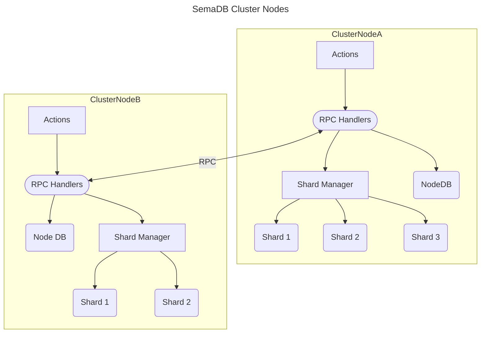

# Cluster Node

A single cluster node represents a server in the SemaDB deployment. The `ClusterNode` struct is a self-contained entity and encapsulates the RPC communication to other servers. The client to data journey is covered by the following critical files:

- [clusternode.go](clusternode.go): sets up a cluster node instance to handle all init and closing functions as well as some background functions like the RPC server and backup functionality.
- [actions.go](actions.go): is the public facing API of the cluster node. It mostly mirrors what you would expect a user to be able to do such as creating a collection and inserting points. It also contains some extra functions such as getting shard info.
- [rpchandlers.go](rpchandlers.go): is the internal facing RPC API. Each cluster node may communicate with other cluster nodes over the RPC network to complete a task depending on the *rendezvous hashing* used. Internal routing between nodes is handled in each function transparently to make it clear what is going on.
- [shardmgr.go](shardmgr.go): opens and provides instances of shards to complete the jobs. It ensures that a shard cannot be unloaded whilst being used etc. It also currently manages automatic backups of shards.

## Critical paths

- **User to collection to shard**: to reach the actual shards that contain the data, we look at the current user. Then determine the collection we are interested in (see storage below). Based on the collection shards, perform routing such as search all the shards, insert these points in to that shard etc.
- **Actions to RPC**: almost all actions make rpc calls. Who calls what, where and how is really important to the overall system. At the moment [rendezvous hashing](https://en.wikipedia.org/wiki/Rendezvous_hashing) is used in actions according to request parameters such as user id or shard id. The main routing idea revolves around picking who (which server) is responsible for something. Some actions such as searching every shard, interacts with every server that holds those shards.
- **Shard loading and unloading**: the shard manager juggles open shards and attempts to unload unused ones. During operation, incoming requests and the clean up goroutine will attempt to access the same shard. Care must be taken to avoid concurrency bugs and potential corrupting of the database file for example by closing the shard whilst inserting points.
- **RPC fail between cluster nodes** might occur and the user will get an error. But what happens to the request routed to the shard? Well the shard might have completed it. In this case, the user is encouraged to retry the request and the response should include whether a point is duplicated, already deleted etc.

## Storage

The node itself makes use of a key-value store for:

- `<userId>/<collectionId>` stores the `models.Collection` object. It is assumed at this point this cluster node is responsible or should have copies of the collection entry. Since the collection name / id  is part of the key, we therefore restrict what the user can provide as a collection name in the HTTP API. The alternative is to have an internal UUID with a mapping between user collection names and UUIDs, or just ask the user to live with UUIDs they might not be able to remember which collection was which.

## Design choices

The original design of the cluster node was to also include the HTTP API. Since we already run an RPC server, the http server would sit next to all the necessary functionality already offered by the cluster node. But this overloaded the cluster node with very similar but subtly different sets of functionality. For example, incoming HTTP requests need user auth, validation, whitelisting etc whereas we assume internal RPC calls are safe. Despite almost mirroring the http calls in the public facing actions, decoupling http requests from cluster node helped better structure the code and test it.

Another concern was the similarity of actions and the rpc handlers. Each action curates and calls the necessary rpc calls. The reason they are separate is because some actions such as searching, make multiple rpc requests. Having a clear boundary between what is computed on the node vs across rpc helped with debugging.
