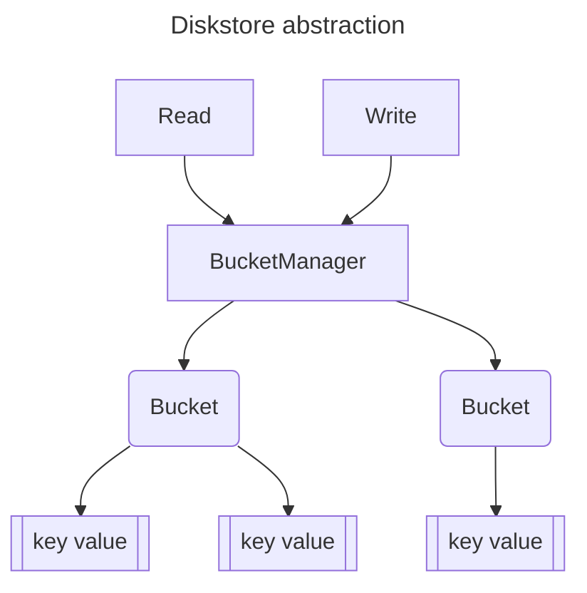

# Disk Storage

This package aims to provide a thin abstraction over the storage layer to unify access across the application. We are not necessarily interested in creating a full adapter pattern approach in case we swap out our storage layer, it is more to stop us digging further into the specifics of an implementation and simplify common operations. Some of the goals are:

- Keep the exposed APIs simpler, for example details of transactions etc can be simplified. This helps make the upstream operations more robust and concise.
- Restrict access to operations such as splitting read-only operations from read-write stuff at compiler level. For example, you can't write to a disk inside a read operation, it should error out.
- Have a common way of handling disk files such as opening bbolt files using the same options.

The main disk storage is handled by [bbolt](https://github.com/etcd-io/bbolt) and the wrapping interfaces follow it's API closely. There is also an in-memory storage based on maps.

## Thread safety

- Diskstore `Read` and `Write` are thread safe, so multiple go routines can call them to get a consistent view to work with. This is handled automatically by bbolt and with a read-write lock for the in-memory store.
- Creating buckets from the bucket manager within and diskstore read or write is also thread safe. We handle this case manually by locking because features such as multi-indexing create buckets on the fly for each index in parallel. The bucket manager is not called as often, once per index so the locking is not a big overhead.
- Concurrent reads and writes to the **same bucket are not thread-safe**, i.e. multiple go routines reading and writing to the same bucket. This is to improve performance. After indexing 10k vectors in parallel, we might need to write 20k key values if not more. Each write would race to modify the diskstore (change the b+ tree in bbolt, or map in memory store).
  - Why not lock on write then? Then all those 20k writes would have to acquire and release locks creating a big overhead.
  - Why not use a call context like `Read` and `Write`? Nothing stops the user from acquiring a lock then creating multiple go routines to write. That is, inside a single write context, the user can spawn multiple go routines. So it boils back down to the user ensuring there is one writer.
- Instead, concurrent reads are allowed but a single go routine must write to the bucket with no other writers at the same time. This is the responsibility of the callers to avoid very fine grain locking on the diskstore end.
- Check thread-safety of package using `go test -race ./diskstore`, it deliberately doesn't contain a test for concurrent read and write of the same bucket.

> Do not create or have multiple go routines writing to the same bucket. Think of bucket as a map, you wouldn't write to a map from multiple go routines without a lock.

So how do we get around this? We usually have a in-memory cache that offers faster operations and then a `flush` method to write everything from a single go-routine to disk.

## Difference between cache

The in-memory implementation may look like a pre-cursor to a cache but the actual shard level cache stores decoded point data. Caches are for objects whereas diskstore is key value byte slices. This is important because encoding or decoding large vectors often is a considerable overhead.

But wait, there is also an automatic cache for bbolt file. The file pages of a bbolt database are cached by the operating system. The OS caches pages read from and written to the file, so we get that for free and actually have no control over it.