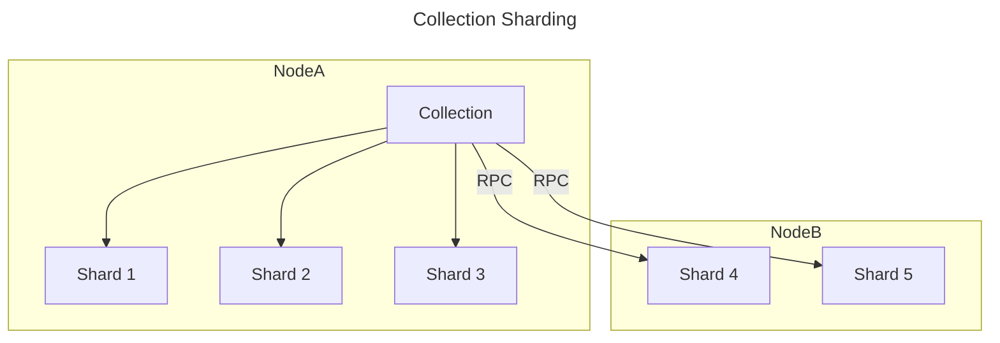

# Collection

A collection in SemaDB is a group of [points]() / documents that share a common [index schema](). You may create several collections in a single database, each with its own index schema to organise and group your data.

A collection defines a search boundary such that all indexed points are searchable together. This is important to remember when deciding how to organise your data. It's quite common to have a single collection for each logical type of data you have such as `products`, `documents` etc and in general most applications have a single collection to search over. Recall that SemaDB isn't a relational database but more of a search engine.

> Please refer to [indexing]() to learn more about how to define the schema for a collection.

## Collection ID

The collection ID is a unique identifier *per user* that is used to reference the collection in all operations. It is an alpha numeric string and must be unique within the user's account. There is usually a limit on the length of the collection ID and it is recommended to keep it short and descriptive.

## Shards

A collection is divided into multiple shards to distribute the data across the cluster. Each shard is a self-contained index that can be searched independently and the collection level actions orchestrate the operations across all the required shards.

The **sharding happens automatically** based on the configuration of what the maximum shard size should be. Multiple shards can exist on a single node or across multiple nodes in the cluster. This translates to either concurrent multi-threaded operations on a single node or distributed operations via remote procedure calls across multiple nodes.

> There is no requirement to run SemaDB on multiple nodes. A single traditional server can run SemaDB with multiple shards and still benefit from the parallelism.