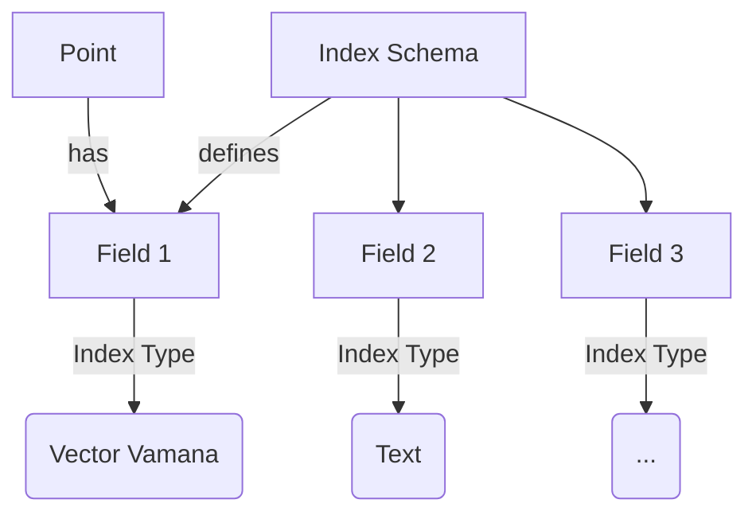

# Indexing

To search for something in SemaDB, you need to index it first. Indexing is the process of creating a data structure that allows you to quickly search for a specific value in a large dataset. In SemaDB, you can index any field in a point / document.

SemaDB supports several indexes and each collection can have multiple indexes. These are set at the collection level so all points follow the same schema. The **index schema** determines which fields are indexed and what type of index is used.



> A [point or document]() can and often have extra fields beyond those that are indexed. A common use case is adding metadata to a point. You can also leave an indexed field blank of a point to remove it from search results, i.e. skip indexing.

This page discusses the various index types SemaDB has. **For detailed information on index parameters, please refer to the [API Reference](/api-reference.html).**

## Example

Here is an example of an index schema for a collection e-commerce products. This is an exhaustive example; most practical applications will have fewer fields to index. Remember that indexed fields are used for searching, a point / document may have other fields that are not indexed.

```json
{
    "id": "products",
    "indexSchema": {
        "descriptionEmbedding": {
            "type": "vectorVamana",
            "vectorVamana": {
                "vectorSize": 386,
                "distanceMetric": "euclidean",
                "searchSize": 75,
                "degreeBound": 64,
                "alpha": 1.2
            }
        },
        "description": {
            "type": "text",
            "text": {
                "analyser": "standard"
            }
        },
        "category": {
            "type": "string",
            "string": {
                "caseSensitive": false
            }
        },
        "labels": {
            "type": "stringArray",
            "stringArray": {
                "caseSensitive": false
            }
        },
        "size": {
            "type": "integer"
        },
        "price": {
            "type": "float"
        },
        "dates.created": {
            "type": "string",
            "string": {
                "caseSensitive": false
            }
        }
    }
}
```

with an example point:

```json
{
    "SKU": "1234",
    "currency": "GBP",
    "descriptionEmbedding": [0.1, 0.2, 0.3, ...],
    "description": "This is a product description",
    "category": "electronics",
    "labels": ["new", "sale"],
    "size": 10,
    "price": 100.0,
    "dates": {
        "created": "2021-01-01",
        "updated": "2021-01-02"
    }
}
```

## Index Types

### Vector Vamana

type: `vectorVamana`

The Vamana index is the main recommended index for vector similarity search in SemaDB. It is a fast and accurate graph based index. It works by constructing a similarity graph of the points based on their distances. During search, this graph is used to find the nearest neighbors of a query point. It is based on the following excellent research papers:

- Jayaram Subramanya, Suhas, et al. "Diskann: Fast accurate billion-point nearest neighbor search on a single node." Advances in Neural Information Processing Systems 32 (2019) [link](https://proceedings.neurips.cc/paper_files/paper/2019/file/09853c7fb1d3f8ee67a61b6bf4a7f8e6-Paper.pdf).
- Singh, Aditi, et al. "FreshDiskANN: A Fast and Accurate Graph-Based ANN Index for Streaming Similarity Search." arXiv preprint arXiv:2105.09613 (2021) [link](https://arxiv.org/abs/2105.09613).

The recommended parameters are:

- `vectorSize`: The size of the vector. This is the number of dimensions in the vector.
- `distanceMetric`: The distance metric to use.
- `searchSize` (recommended 75): The size of graph search when inserting a point. Inserting points actually works by searching for that point to find the nearest neighbours and then creating edges to those points.
- `degreeBound` (recommended 64): The maximum number of edges to keep for each point in the graph. This is a trade-off between accuracy and speed. Higher values give more accurate results but are slower because they create denser graphs.
- `alpha` (recommended 1.2): The alpha parameter in the Vamana paper. It controls how optimistic the pruning of edges is. Higher values create denser graphs. From the paper: "Generating such a graph using 𝛼 > 1 intuitively ensures that the distance to the query vector progressively decreases geometrically in 𝛼 in Algorithm 1 since we remove edges only if there is a detour edge which makes significant progress towards the destination. Consequently, the graphs become denser as 𝛼 increases."


### Vector Flat

type: `vectorFlat`

A flat index refers to an exhaustive search of all points in the collection. This is the simplest index and is not recommended for large collections. It is useful for small collections or for testing purposes. If you have less than 10k points, it might be okay to use this index. Otherwise, use the Vamana index.

There really is not magic happening here. When a search request comes in, the server will calculate the distance between the query point and **all** the points in the collection. This is very slow for large collections.

> But there is hope, it may be possible to make use of this index if you still have a relatively small collection but use a [quantiser]() or **have binary vectors**. In those cases, the memory footprint of the index is much smaller and the search is faster.

### Text

type: `text`

The text index is used for full-text search. It uses an analyser to tokenize the text and create an [inverted index](https://en.wikipedia.org/wiki/Inverted_index). It is also referred to as keyword based search.

A key concept is the **analyser**. This is a set of rules that determine how the text is tokenized. For example, the `standard` analyser will split the text into words and remove punctuation to improve search results. We plan to add more analysers in the future.

During search, the query text is also tokenised and the keywords are searched in the inverted index. The search results are then ranked using [TF-IDF](https://en.wikipedia.org/wiki/Tf%E2%80%93idf). The search can be changed to either include all the keywords or any of the keywords.

### String

type: `string`

The string index is used for exact match search or filtering. It is used for fields that have a small number of unique values. For example, a field like `category` in an e-commerce collection is a good candidate for a string index.

You can also perform a prefix search on string fields which is useful for autocomplete or type-ahead search. Another use case for prefix search is [geo hashes](https://en.wikipedia.org/wiki/Geohash) for location based search.

type: `stringArray`

The string array index is used for exact match search on an array of strings. Again, it is used for fields that have a small number of unique values. A common example is a field like `labels` in a document collection so you can search or filter by labels.

Both string and string array indexes have a `caseSensitive` parameter. If set to `true`, the search will be case sensitive. Case sensitive searches are not common but may appear in certain domains such as molecular biology.

### Numeric

type: `integer`

Integer indexes are commonly used for fields that have a range of values. The above example uses an integer index for the `size` field which allows us to search or filter based on operators like equals, greater than, less than etc.

type: `float`

Same as integer but for floating point numbers.

Numeric indices are also handled using inverted indexes. Having a lot of unique values in a numeric field can lead to a large index size.
