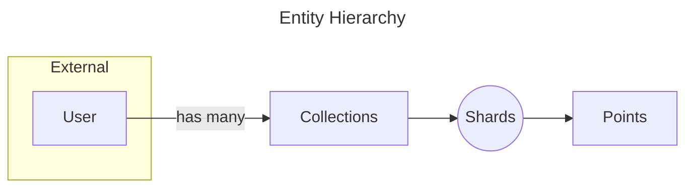
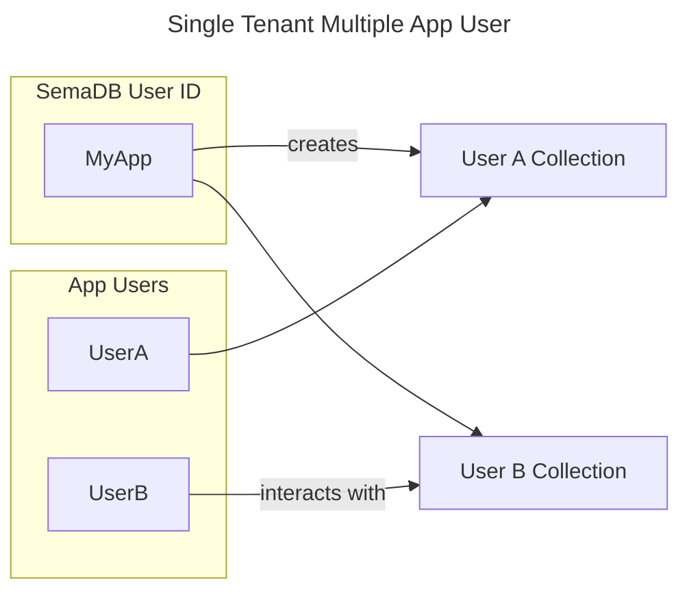
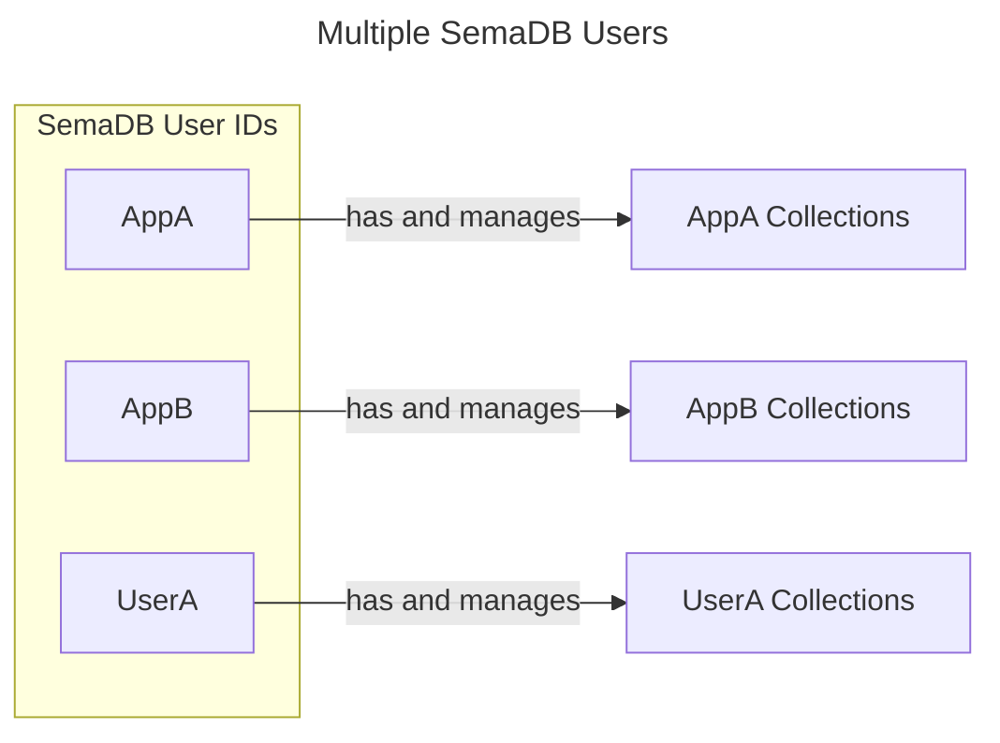

# Multi-Tenancy

SemaDB is designed to be multi-tenant from the ground up. This means that you can have multiple users sharing the same SemaDB instance and each user can have their own set of collections. This is useful in an environment where you want multiple users interacting with a single SemaDB instance / cluster.

> Different users can have the same collection name but they will be isolated from each other. This is because the collection name is prefixed with the User ID.

There is no special configuration required to enable multi-tenancy in SemaDB. It's built into the system and is enforced by the User ID. You can start with a single ID for your application and if necessary split it into multiple IDs as your application grows or the use case changes.



## User ID

The user is actually an external entity to SemaDB and is usually provided by a proxy or the application that interacts with the system. SemaDB only requires a User ID string and it is attached to every request made using the header `X-User-Id` since SemaDB doesn't store it. This is a deliberate choice to reduce the complexity of SemaDB and make it adaptable to different environments.

> For self-deployed single tenant setups, you can set the User ID to any unique identifier, commonly the project or application name.

You can think of the User ID as the top-level directory for the data. [Collections]() effectively get prefixed with the User ID to organise them accordingly and enforce [user plans](). Despite its name, you can use the User ID to organise collections for different applications and projects as well. It's flexible enough to be used with any unique identifiers.

For example, if you have two applications running on the same SemaDB instance, you can set the User ID to the application name and then create user plans to enforce limits such as maximum points per collection, maximum number of collections etc.

### User Plan

The other required header for each request is the `X-User-Plan` header which is used to enforce limits on the user / application. A sample from the [configuration]() section is shown below:

```yaml
  userPlans:
    BASIC:
      name: Basic Plan
      maxCollections: 1
      maxCollectionPointCount: 1000000 # 1M
      # This is after the point is encoded and includes any vector fields.
      maxPointSize: 1024 # 1KiB
      shardBackupFrequency: 3600 # 1 hour
      shardBackupCount: 2
```

User Plans are mainly used for rate limiting and to enforce quotas. They act as safeguards in place before someone or your application accidentally or intentionally abuses the service, e.g. by creating too many collections.

## Multiple Users vs Multiple Collections

A common mistake is to pass **application level User IDs** as the User ID to SemaDB. This is not recommended because your application users *are not* using SemaDB, your application is. For example, if you have a chat application that stores user content like documents to vector search later, you should use the application name as the SemaDB User ID and then create collections for each user. There is no problem creating collections with user names and they act search boundaries so your application users won't be accessing cross-collection data. Any collection management will be invisible to your users. This way you can enforce limits on the application level and not on the user level.

On the other hand, if you have multiple applications or direct users interacting with SemaDB, you should use the User ID as the application name and then create collections for each user. When setup like this, you can adjust user plans for each application and user.

Here is an illustration of the two scenarios:



alternatively:



> If you are unsure about which way to go, we recommend starting with the application name as the User ID and then creating collections as usual.