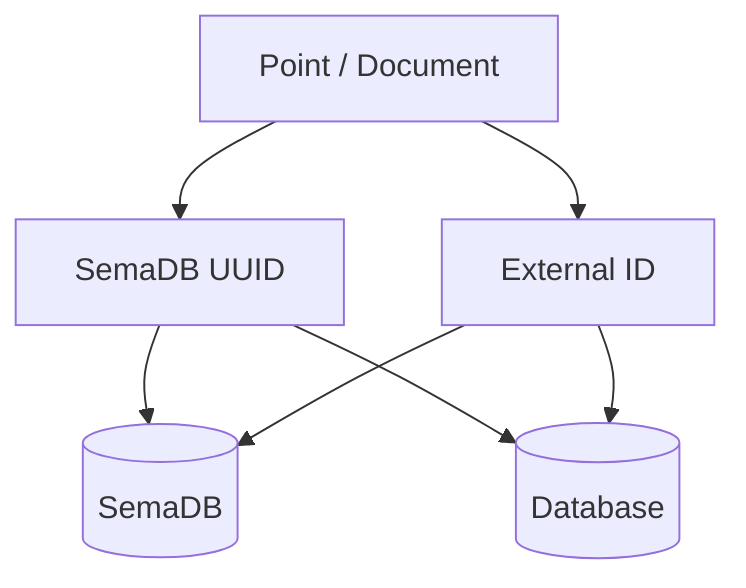

# Point / Document

A point, document is the smallest unit of data in SemaDB. It is a JSON object that is stored as part of a [collection](). A point can have any number of fields and the fields can be of any type. Usually there is a limit on the total size of the point that can be stored. If you are self-hosting you can adjust this limit in the configuration file, but it is recommended you have a limit. Here is an example point / document:

```json
{
    "city": "Edinburgh",
    "country": "Scotland",
    "areaCode": 0131,
    "population": 500000,
    "embedding": [0.1, 0.2, 0.3, 0.4, 0.5],
    "tags": ["capital", "historic", "tourist"],
    "link": "https://en.wikipedia.org/wiki/Edinburgh",
    "location": {
        "coordinates": [55.953251, -3.188267],
        "map": "https://www.openstreetmap.org/?mlat=55.953251&mlon=-3.188267"
    }
}
```

> While the fields can be of arbitrary types, the fields that are used for [indexing]() need to be in the format the index expects. For example, if you have an integer index for population field, the population field should be an integer. If you have a text index for city field, the city field should be a string.

## Point ID

Each point has a unit [universally unique identifier](https://en.wikipedia.org/wiki/Universally_unique_identifier). This is used to identify the point in the collection. This ID may be provided using `_id` when inserting points or let the server generate UUID4 for you. If you provide an ID, ensure it is unique in the collection:

```json
{
    "_id": "f7b3b3b4-3b7b-4b3b-8b3b-3b7b3b7b3b7b",
    "...": "...",
}
```

**What if I have existing data with integer or other string IDs?** In this case we recommend you store it as an integer or string field in the point itself as well as storing the SemaDB point ID in the external database. This way you can easily link the data in the external database to the data in SemaDB. This creates a **cross-reference** between the external database and SemaDB:



In this setup, you can pre-generate the UUIDs for the points and store them in the external database. When you insert the points into SemaDB, you can use the same UUIDs.

