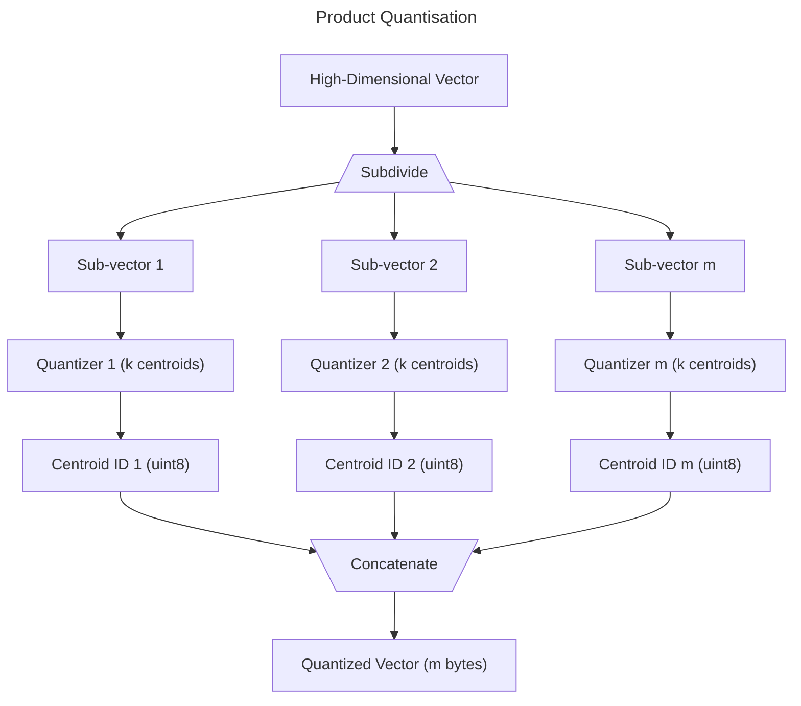

# Quantization

Quantisation is in this context refers to reducing the memory footprint of vectors by converting them to a lower precision format. This is useful when you have a large dataset and want to reduce the memory footprint of the vectors.

By default, vectors are stored as 32-bit floating point numbers. This means each dimension of the vector is 4 bytes. For example, a 512-dimensional vector would be 2KB in size. This can quickly add up for large datasets. Another use case is if you already have vectors in a lower precision format and want to use them with SemaDB such as binary vectors.

> Quantising floating point vectors to lower precision is always a trade-off between memory footprint and accuracy. Information is inevitably lost when converting to lower precision.

For full details on how to use quantisation, please refer to the [API reference](/api-reference.html).

## Binary Quantisation

type: `binary`

Binary quantisation is a special case of quantisation where the vectors are converted to binary format using only 1 bit per dimension. Considering again a 512-dimensional vector, the binary version would be 64 bytes in size. This is a 32x reduction in memory footprint compared to the 32-bit floating point format.

The following parameters are relevant:

- `threshold` (optional): The threshold to use when converting the vectors to binary format. It determines whether a value is set to 1 or 0 by checking if it is greater than the threshold. For normally distributed embedding models, a threshold of 0.0 is a good starting point. For other models, you may need to experiment with different thresholds.
- `triggerThreshold` (optional): It is the number of points after which threshold should be automatically computed. The threshold is set to the **mean** of all the values in all the vectors. This is useful when you're not sure what threshold to use.
- `distanceMetric`: The distance metric to use when searching. You can use the `hamming` or `jaccard` [distance metric]().

### Binary Vectors

If you have binary vectors to start with and set a [binary distance metric]() at the [index schema]() level, then SemaDB automatically enables binary quantisation with threshold set to 0.5 and the corresponding distance metric.

When inserting or searching, you need to ensure that the vectors are still in floating point format, e.g. `[0.0, 1.0, 0.0, 1.0]`. The server will automatically convert the vectors to binary format when storing them using the 0.5 threshold.

## Product Quantisation

type: `product`

[Product Quantization](https://ieeexplore.ieee.org/document/5432202) is a technique to quantise high-dimensional vectors into a low-memory usage representation. The original vector is divided up to `m` sub-vectors and each sub-vector is quantized to `k` centroids. The final quantized vector is the concatenation of the centroid ids of each sub-vector. When, the centroid ids are uint8 values each sub-vector is 1 byte in size and the final quantized vector is `m` bytes in size saving a lot of memory. For example, a 512-dimensional vector with `m=8` and `k=256` would be 8 bytes in size instead of 2KB.

SemaDB uses [k-means clustering](https://en.wikipedia.org/wiki/K-means_clustering) to find the centroids for each sub-vector. This is performed only once when the product quantisation is *triggered*:

- `numCentroids` (recommended 256): The number of centroids to use for each sub-vector. This is the `k` parameter in the product quantisation algorithm. It is strongly recommended to use 256 as the maximum number of possible values of an unsigned 8-bit integer. You may experiment with other values but it will not lower the memory footprint of the quantised vectors.
- `numSubVectors` (recommended 8): The number of sub-vectors to divide the original vector into. This is the `m` parameter in the product quantisation algorithm.
- `triggerThreshold` (recommended 5000): The number of points after which the centroids should be automatically computed and the vectors are quantised. It may be tempting to increase this to get more vectors, but the centroids are computed in memory and can be quite large. It is recommended to keep this value low to avoid running out of memory.

During search, a pre-computed lookup table is used to find the nearest centroid for each sub-vector. The distance between the original vector and the quantized vector is the sum of the distances between the original vector and the centroids of each sub-vector. Due to this sum, the distance metric must satisfy the property that the sum of distances is a valid distance metric. For this reason, `euclidean` is used even if `cosine` is given as the distance metric. This is not an issue since squared euclidean distance is proportional to cosine distance, i.e. d = 2(1-cosine(x,y)) for normalised vectors.