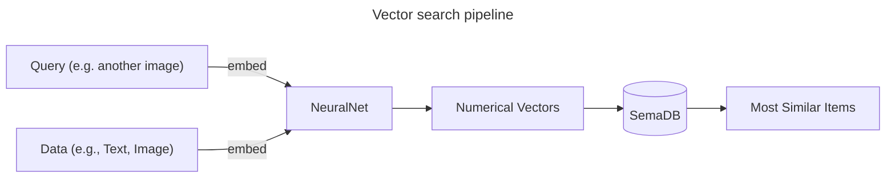

# Introduction

Traditional databases are fantastic tools for storing and retrieving structured data, the kind neatly organized into rows and columns. But what happens when your data isn't so easily defined? Think of images, audio clips, or complex text descriptions—this type of unstructured data requires a different approach. That's where vector databases and vector search engines come into play.

[SemaDB](https://semadb.com) fills this gap by providing a powerful, open-source vector database that can handle complex data types and perform similarity searches. This guide will help you understand the core concepts behind vector databases, how they differ from traditional relational databases, and the exciting use cases they enable.

# Understanding Vectors and Embeddings

At the heart of a vector database lies the concept of "embeddings." Embeddings are numerical representations of data. Advanced machine learning algorithms can transform text, images, and other complex data types into these numerical vectors. These vectors live in a multi-dimensional space, where similar items tend to cluster together.

SemaDB allows you to add structured metadata such as tags, categories, or timestamps to these vectors. This metadata can help you filter and organize your data, making it easier to search and retrieve. It also allows you to perform different types of searches:

- **Vector Search:** Find items similar to a given query, such as finding images similar to a reference image.
- **Structured Search:** Search based on metadata, such as finding all images with a specific tag.
- **Filtered Search:** Combine vector and structured search to find items that are both similar and meet specific criteria.
- **Hybrid Search:** Combine vector and text search to find items that are both similar and contain specific keywords.

> You can also completely ignore vectors and use SemaDB as a regular search engine over structured data. For example, ask SemaDB to find all images with a specific tag or all text documents created after a certain date.

# Vector Search: Similarity as the Measure

Unlike relational databases that rely on exact keyword matches or rigid criteria, vector search engines are all about finding similarity. A vector search engine analyses your query (say, a text description or an image),  converts it into a vector, and then scans the database to find the vectors that are closest in the embedding space. Essentially, it tells you, "Here are the items most similar to what you're looking for."

## Use Cases: Where Vector Databases Shine

The potential applications of vector databases are vast and exciting. Some of common use cases at the moment are:

- **Semantic Search:** Search engines that understand the meaning and nuances of your query, not just keywords.
- **Image Similarity Search:** Find visually similar images, revolutionizing how we organize photo collections or detect duplicate content.
- **Recommendation Engines:** Suggest products, content, or even people based on complex patterns and relationships, not just simple "likes".
- **Fraud Detection:** Identify unusual patterns in data that might be indicative of fraudulent activity.

# SemaDB vs. Relational Databases

**SemaDB doesn't replace traditional relational databases.** Rather, it complements them to provide extra search functionality for unstructured data. Here's how vector databases compare to relational databases and why you might want to potentially use both:

- Relational Databases: Excel at handling highly structured data with clear relationships (think customer records, financial transactions).
- Vector Databases: Shine in managing unstructured data with complex patterns where similarity and context are crucial.