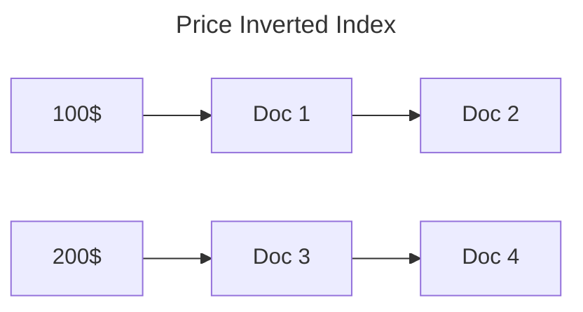

# Basic Search

The basic search is the simplest form of search in SemaDB covering the [inverted indices]() you can create. These commonly include integers and strings.

Here is an example of a basic search query, see [overview]() for other request level parameters:

```json
{
    "query": {
        "property": "price",
        "float": {
            "value": 100,
            "operator": "inRange",
            // endValue is only used with inRange operator
            "endValue": 200
        }
    },
    "limit": 10
}
```

## Inverted Index

It is important to recall how inverted indices work to get a better understanding of the what the basic search can do. An inverted index is a data structure that maps the values of a field to the documents that contain them. This allows for fast lookups and filtering of documents based on the values of a field.



So when we search for all the documents with price 200$, we can quickly find that it is in `Doc 3` and `Doc 4`. This is the basic idea behind the basic search.

There really isn't too much magic and just a simple lookup in the inverted index. The real power of SemaDB comes from the ability to combine these simple lookups with other types of searches like [vector search]() and [text search]().

## Operators

The following [index types]() can be used in a basic search query: `integer`, `float` and `string`. In all cases you provide a value and an operator. The available operators are:

- **equals**: The value must be equal to the provided value.
- **notEquals**: The value must not be equal to the provided value. *This causes an index scan*, so it is not recommended for large collections. To find all the values that are not equal, SemaDB scans the entire index.
- **greaterThan**: The value must be greater than the provided value.
- **greaterThanOrEquals**: The value must be greater than or equal to the provided value.
- **lessThan**: The value must be less than the provided value.
- **lessThanOrEquals**: The value must be less than or equal to the provided value.
- **inRange**: The value must be in the range of the provided value and endValue. With this operator you must provide both `value` and `endValue`.
- **startsWith** (string only): The string must start with the provided value.

# String Array

The array / list of strings uses different operators. This index type is commonly used for tags or categories. The operators available are:

- **containsAll**: The list must contain all the provided values.
- **containsAny**: The list must contain at least one of the provided values.

A common examples when searching or filtering for tags is:

```json
{
    "query": {
        "property": "tags",
        "stringArray": {
            "value": ["tag1", "tag2"],
            "operator": "containsAll"
        }
    },
    "limit": 10
}
```