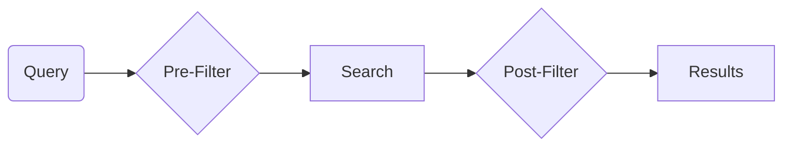

# Filtered Search

Filtered search is a powerful feature that allows you to filter the search results based on the results of other queries. In SemaDB, these filters can be as complex as full queries themselves. Common use cases include filtering by a property such as price, size, or colour.

There are two filter types:

- **pre-filter**: This filter can only be applied to certain search queries. It is applied before the search query is executed and can be used to reduce the number of points that are searched.
- **post-filter**: This filter is applied *after* the original query is executed.



## Pre-filter

The pre-filter executes the query and returns a set of documents that the upstream search should consider. For example, you might want to perform a vector search of products that are in stock:

```json
{
    "query": {
        "property": "productEmbedding",
        "vectorVamana": {
            "vector": [1, 2],
            "operator": "near",
            "searchSize": 75,
            "limit": 10,
            "filter": {
                // This is another query, could be anything
                "property": "stock",
                "integer": {
                    "operator": "greaterThan",
                    "value": 0
                }
            }
        }
    },
    "limit": 10
}
```

Pre-filters are applicable to ranking indices of type `vectorVamana`, `vectorFlat` and `text` by providing the `filter` parameter.

> Pre-filters only provide a set of allowed points / documents. It is up to the upstream index to decide how to use it. For the Vamana index this actually alters the search algorithm to account for filters as opposed to just performing post-filtering raw vector results.

## Post-filter

Post-filter is just another term for composite `_and` queries. For the same query above, the post-filtering is done using:

```json
{
    "query": {
        "property": "_and",
        "_and": [
            {
                "property": "productEmbedding",
                "vectorVamana": {
                    "vector": [1, 2],
                    "operator": "near",
                    "searchSize": 75,
                    "limit": 10
                }
            },
            {
                "property": "stock",
                "integer": {
                    "operator": "greaterThan",
                    "value": 0
                }
            }
        ]
    },
    "limit": 10
}
```

In this case, the Vamana search is not altered and items that are out of stock may be returned when performing nearest neighbour search. Then, the result is combined with those that are in-stock effectively acting as a post-filter.

## Which to use?

The choice between pre-filter and post-filter depends on the application. Pre-filters are used for cases where you want to search only a subset of the data. Post-filters are useful for combining multiple queries. Here are some example use cases:

- **(pre-filter)** Vector search for the most similar products that are in stock. This is the example above.
- **(pre-filter)** Text search for products containing the word "red" that are in stock. You don't want any out of stock items being ranked in the text search.
- **(post-filter)** Search for products that are in stock and have a price less than $100. This is a combination of two queries but act as a post-filter because of the products that are in stock we then filter by price.
- **(post-filter)** Search for products that are in stock and have a price less than $100 or are in the "sale" category.

Another thing to note is that **pre-filters are computed linearly** while **post-filters are computed in parallel**. This means that pre-filters can be slower than post-filters if the filter is complex.

## Combining Filters and Specificity

Because filters are just queries, you can create both pre-filter and post-filter in one query. One can get carried away by adding to many conditions to the query which can lead to not only slow queries but also filtering out a lot.

The **specificity** of a filter is the number of points that match the filter. The more specific the filter, the fewer points that match. If it reaches a critical point such as the search size of the Vamana search algorithm, the actual vector search doesn't happen because we can't search for more than the number of filtered documents. This is absolutely fine! It just means that the filter is too specific and the search is not needed.