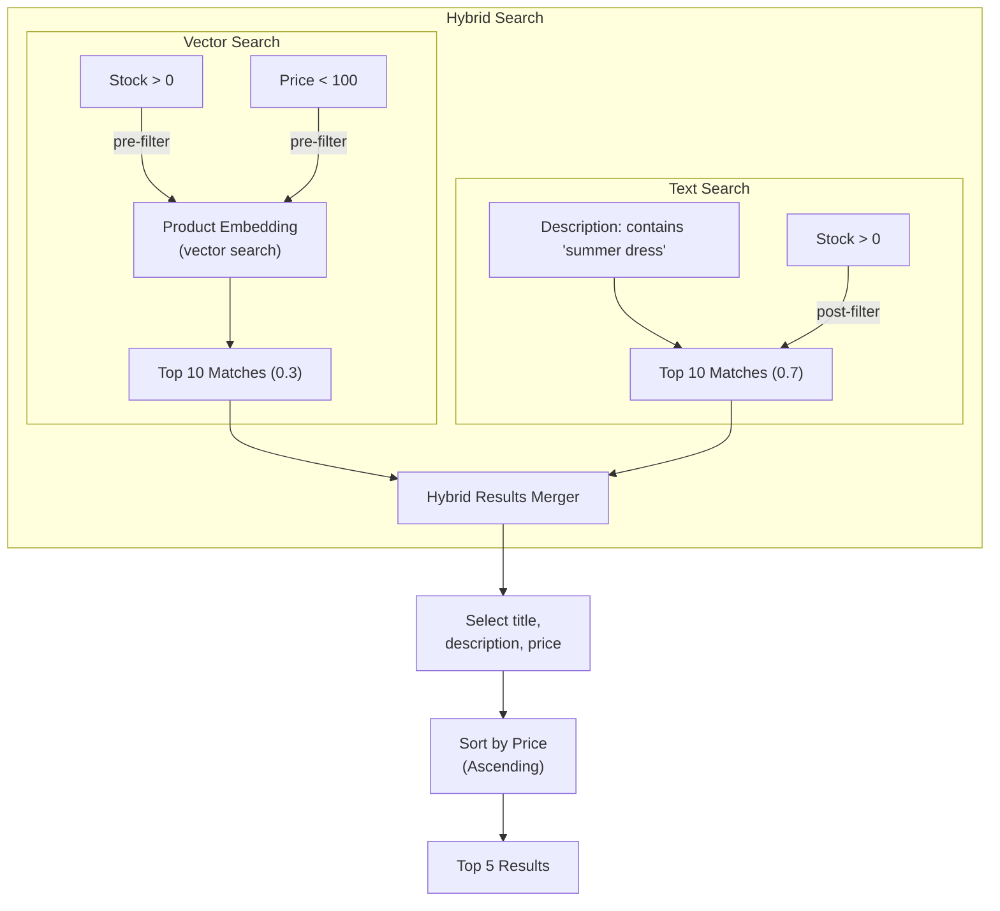

# Kitchen Sink Example

Here is an example of how complex you can get with the search API. This is mainly for demonstration purposes and it neither exhaustive nor realistic as the search API can be combined in many ways.

> Search for products that are similar to a given vector and are in stock with price less than £100 or products that contain the words "summer dress" in the description and are in stock by weighting 0.3 and 0.7 respectively. Return the title, description and price of the top 5 results sorted by price in ascending order.



The actual query would look like:

```json
{
    "query": {
        "property": "_or",
        "_or": [
            // Hybrid search
            {
                // Filtered vector search
                "property": "productEmbedding",
                "vectorVamana": {
                    "vector": [1, 2],
                    "operator": "near",
                    "searchSize": 75,
                    "limit": 10,
                    "filter": {
                        // Composite search as pre-filter
                        "property": "_and",
                        "_and": [
                            {
                                // Basic search
                                "property": "stock",
                                "integer": {
                                    "operator": "greaterThan",
                                    "value": 0
                                }
                            },
                            {
                                "property": "price",
                                "float": {
                                    "operator": "lessThan",
                                    "value": 100
                                }
                            }
                        ]
                    },
                    "weight": 0.3
                }
            },
            {
                "property": "_and",
                "_and": [
                    // Post-filtered text search
                    {
                        "property": "description",
                        "text": {
                            "value": "summer dress",
                            "operator": "containsAll",
                            "limit": 10,
                            // Weight used towards hybrid search
                            "weight": 0.7
                        }
                    },
                    // Of the documents that contain summer dress the most
                    // filter out those that are out of stock
                    {
                        "property": "stock",
                        "integer": {
                            "operator": "greaterThan",
                            "value": 0
                        }
                    }
                ]
            }
        ]
    },
    "select": ["title", "description", "price"],
    "sort": [
        {
        "field": "price",
        "descending": false // ascending order
        }
    ],
    "limit": 5
}
```