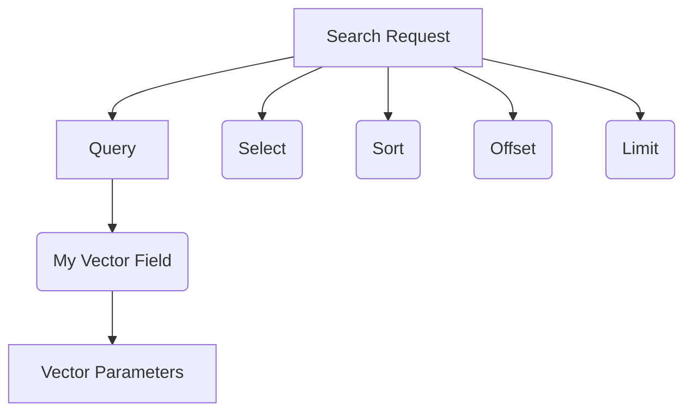
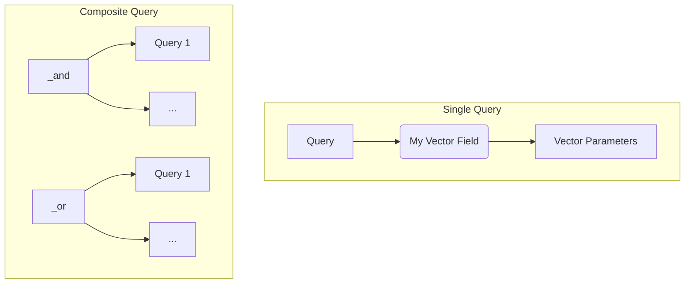

# SemaDB Search Overview

POST: `/collections/{collectionId}/points/search`

To search for points / documents in SemaDB, we make a post request to the search endpoint of a collection with a query object. The query object is a JSON object that contains the search parameters which can be of different types like text, vector, and hybrid. These can also be combined to create complex and powerful queries.

The overall request consists of the following parts:

- **Query**: What to search for and how? This can be a text query, a vector query, or a hybrid query.
- **Select** (optional): What fields to return in the search results. It is often common to not return all fields in the search results, especially vector fields. You can select nested fields using the dot notation such as `nested.field` or use `*` to select all fields.
  - If you don't select any fields, only the `_id` field along with any scoring / distance fields will be returned.
- **Sort** (optional): How to sort the search results. This can be based on a field or a distance from a vector. Any sort fields must be *selected* first.
- **Offset** (optional): How many results to skip from the beginning of the overall search results.
- **Limit**: How many results to return from the search results.

Please refer to the [API documentation](/api-reference.html) for more details on the search endpoint and parameters.



Here is a full single query example:

```json
{
    "query": {
        "property": "productEmbedding",
        // Vamana index search parameters
        "vectorVamana": {
            "vector": [1, 2],
            "operator": "near",
            // See the vector search section for parameter details
            "searchSize": 75,
            // This limit is independent of the overall limit
            "limit": 10 
        }
    },
    "select": ["description", "price"],
    "sort": [
      {
        "field": "price",
        "descending": false // ascending order
      }
    ],
    "limit": 5
}
```

Notice how the limits in the query object are independent of the overall limit. What we are saying here is, get the nearest 10 points to the vector `[1, 2]` and then sort them by price in ascending order and return the top 5 results.

Each query type has its own set of parameters that can be used to fine-tune the search results. The search results are returned in the form of a JSON object:

```json
{
  "points": [
    {
      "_distance": 0,
      "_hybridScore": -0,
      "_id": "faefe2b1-cf85-48db-9621-94b833ee9cc9",
      "description": "A product",
      "price": 100
    },
    {
      "_distance": 314402.94,
      // Since we don't have a hybrid query, the hybrid score is the same as the distance
      // It is negated to have higher scores indicate better matches
      "_hybridScore": -314402.94,
      "_id": "d2e3ebb5-149a-46e4-8b3f-cd6c38530da3",
      "description": "Another product",
      "price": 200
    }
  ]
}
```

## Composite Queries

Each Query object refers to a single field in the collection. To create complex queries, we can combine multiple queries using the `_and` and `_or` as the query property.



Here is an example request:

```json
{
    "query": {
        "property": "_and",
        "_and": [
            {
                "property": "size",
                "integer": {
                    "value": 10,
                    "operator": "equals",
                }
            },
            {
                "property": "price",
                "float": {
                    "value": 100,
                    "operator": "lessThan",
                }
            }
        ]
    },
    "limit": 10
}
```