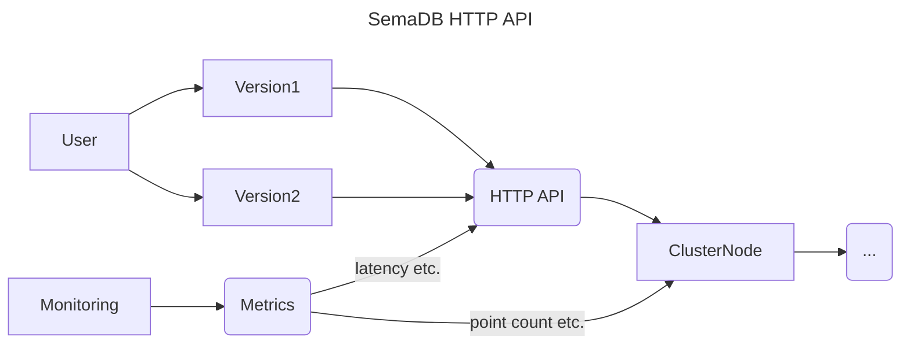

# HTTP API

The HTTP API is the main user facing JSON based Restful API for the database. It governs what the user can do with the database. The design goal is really to favour simplicity and ease of use over. We deliberately avoid things like custom query languages, ambiguous default values, and complex error handling.

The HTTP API is responsible for decoding incoming JSON user input, validating it and then passing it to the underlying cluster node for processing. We try to cover as many checks as possible before it is passed to the cluster node to avoid unnecessary processing.

The package also exposes the [Prometheus](https://prometheus.io/) metrics for monitoring the database. This is a separate server that runs on a different port and is not part of the main API for security reasons.

## Version 1 vs Version 2

The first iteration of SemaDB was purely for vector search and the version 1 of the API reflects that. It is a simple API that allows you to create a database, add vectors to it, and search for vectors. But as we added multi-index support, we realized that the API was not flexible enough to support the new features such as complex queries and index schemas. Recall that the underlying cluster node is ultimately responsible for fulfilling the requests.

> Version 1 of the API is still supported and it just wraps default values for a single vector index.