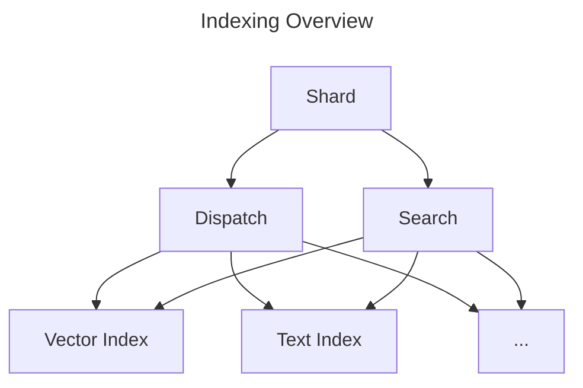

# Indexing

This package covers all indexing related operations used in SemaDB shards. The main goal is to provide a manageable way to create and manage indexes of different types. The package is designed to be thread-safe and can be used concurrently by multiple go routines.

There are two important concepts to understand:

- **Multi-index**: A collection / shard can have multiple indexes. This is useful when you want to search on different fields or with different settings. For example, you might want to search on a `name` field with a `text` index and a `embedding` field with a `vector` index. This is a powerful feature that allows you to search on different fields with different settings.
- **Dispatch**: Takes a channel of incoming changes and routes them to the correct index if any. This is used for create, update and delete operations. Think of it as, a point has changed, do we need to update any indexes?
- **Search**: Takes a query and returns the results, coordinating the search across multiple indexes.

Each index is self-contained and it is up to this package to organise and interact with the underlying index types. Most of the time this is just boring initialisation, type checking and conversion, for example:

1. Does the point have an indexable field according to the [index schema](/models/index.go)? E.g. price, name etc.
2. Is the field type compatible with the index type? E.g. a `float` index requires floating point numbers.
3. Initialise the index if it doesn't exist.
4. Transform the point data into the correct format for the index.
5. Update the index with the new point data.

Refer to the [indexing](/docs/content/docs/concepts/indexing.md) documentation for more user level information.